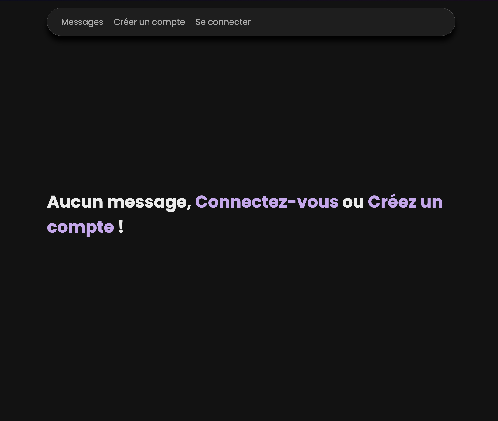
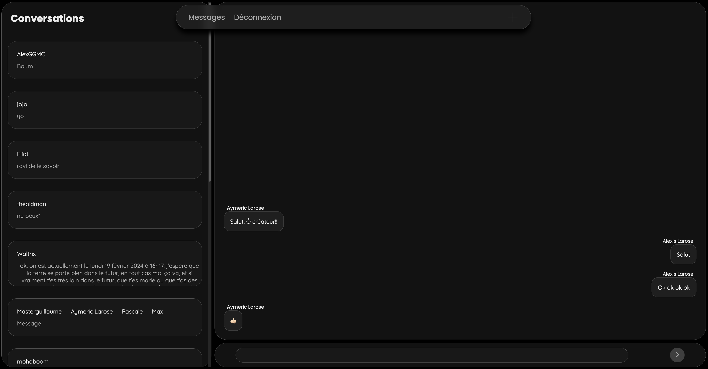
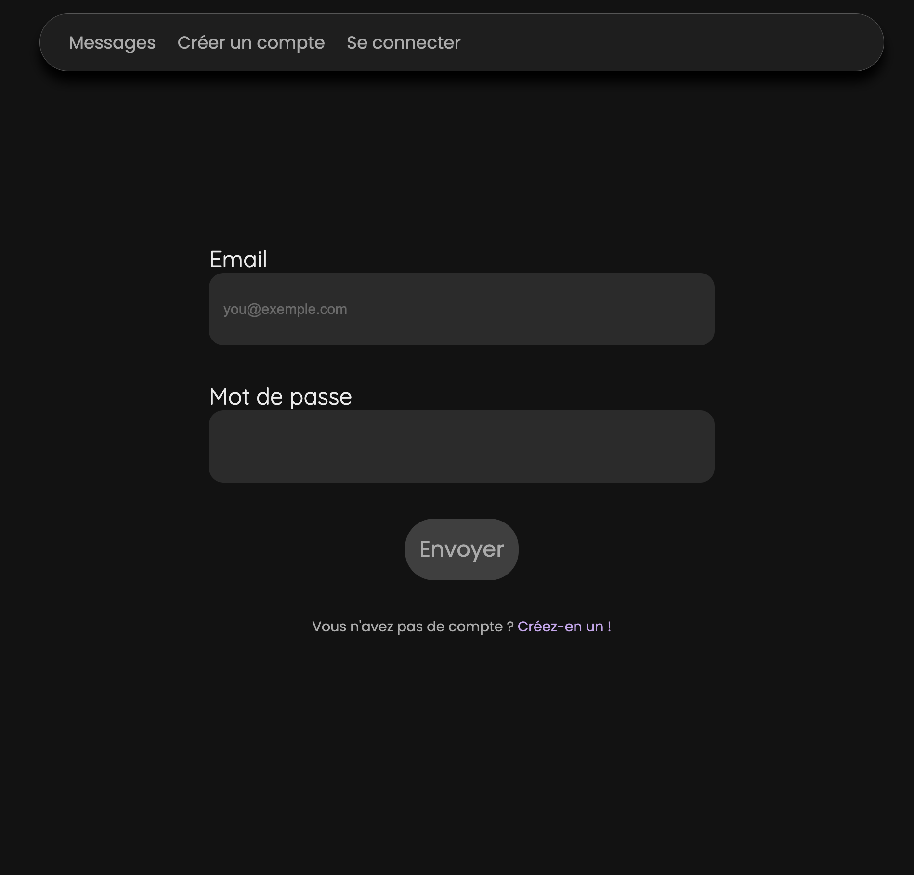
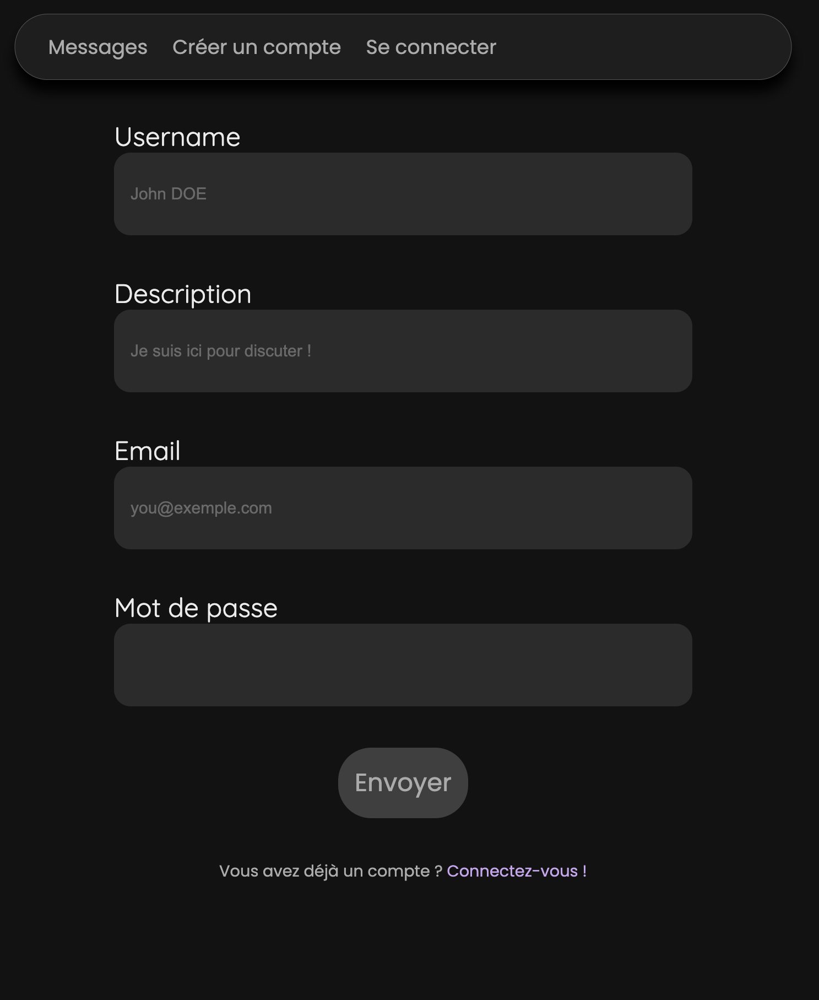
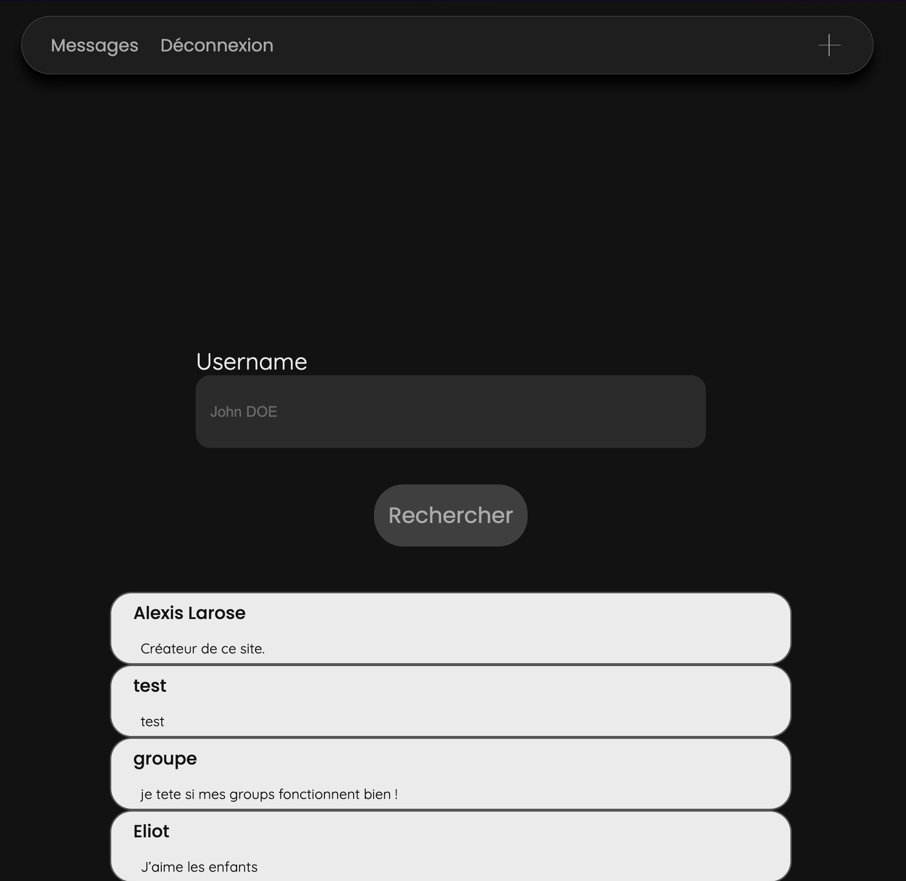
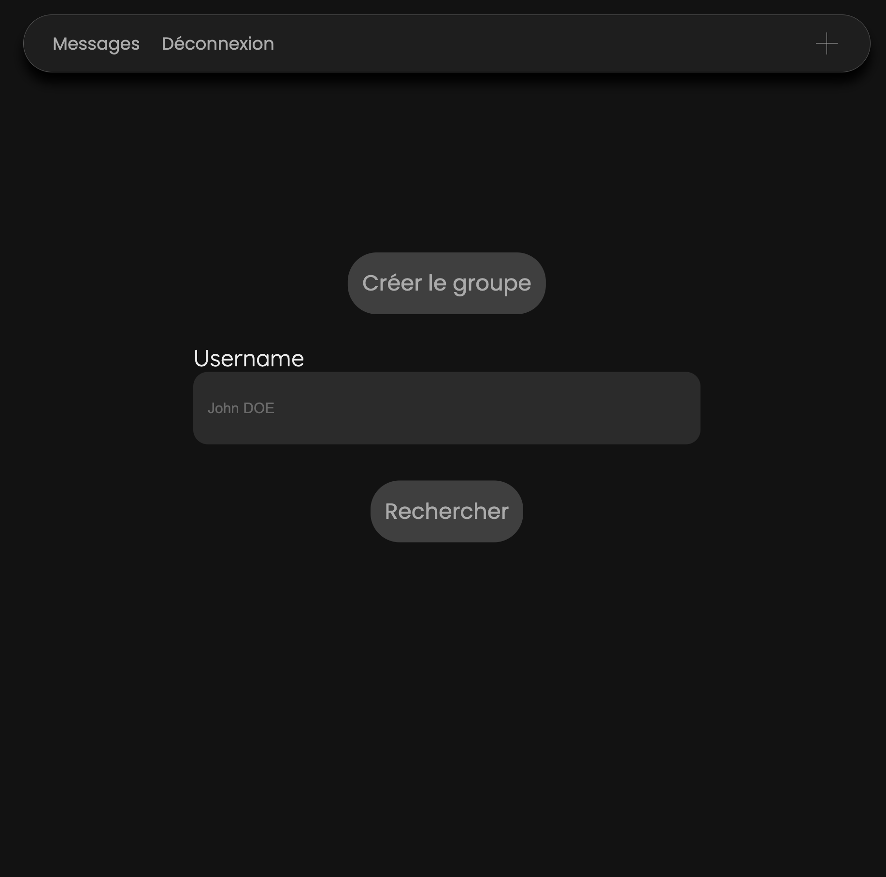

# Messages

## Présentation

Ce projet est une messagerie en PHP 8, utilisant une MySQL pour la base de données. \
Une fois que vous avez créé votre compte et que vous êtes connecté, vous pouvez ajouter des personnes en ami, créer des groupes et discuter avec eux. \
Le seul point noir de ce système si bien rôdé est qu'il faut rafraîchir la page afin de voir les nouveaux messages apparaître, ceci est dû à la **non-présence** de notifications en temps-réel et de la nature de PHP pure.

*Remarque : l'interface de ce projet s'adapte à toutes les tailles d'écran et est donc parfaitement utilisable sur un smartphone.*

Ce projet est **déployé** et **utilisable** à cette adresse : [`https://messages.pifpafdeluxe.fr/`](https://messages.pifpafdeluxe.fr/). \
Je vous **déconseille** de mettre un mot de passe que vous utilisez souvent ainsi que votre véritable adresse e-mail (une adresse bidon fait parfaitement l'affaire) en raison de la ***faible sécurité*** qu'il y a sur ce site. \
Vous pouvez m'ajouter en ami et m'envoyer des messages, peut être que je vous répondrai un jour. Mon nom d'utilisateur sur ce site est *Alexis Larose* :)

## Exemples

> 
> *La page d'accueil de la messagerie quand vous n'êtes pas connecté*

> 
> *La page principale de la messagerie*

> 
> *Le formulaire pour se connecter à son compte*

> 
> *Le formulaire pour créer son compte*

> 
> *Le menu pour ajouter des utilisateurs en ami*

> 
> *Le menu pour créer un groupe*
